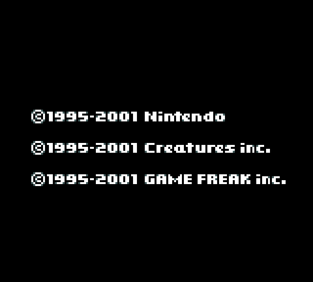
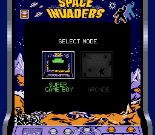

# slopgb

[](https://github.com/FDDTheLucario/slopgb/actions/workflows/ci.yml)

Cycle-accurate Game Boy / Game Boy Color emulator in Rust.

| Pokémon Crystal (CGB) | Space Invaders (Super Game Boy) |
|---|---|
|  |  |

The Super Game Boy shot is the SNES side running for real: the SGB border and
audio come from clean-room SPC700 + 65C816 + SNES-PPU chip cores compiled to
wasm coprocessor plugins, driven by the running Game Boy.

- `crates/slopgb-core` — emulator core: zero dependencies, no unsafe,
  deterministic. Emulates DMG0/DMG/MGB/SGB/SGB2/CGB/AGB models.
- `crates/slopgb` — cross-platform desktop frontend (winit + softbuffer +
  cpal + gilrs) with a bgb-style debugger UI.
- A Rust→wasm plugin system (`slopgb-plugin-api` guest SDK +
  `slopgb-plugin-host` wasmi runtime) with three capability tiers:
  per-frame introspection, MCP tools, and coprocessor subsystems. Super
  Game Boy support runs its SNES side as clean-room chip cores compiled to
  wasm coprocessor plugins — SPC700 + S-DSP audio (`slopgb-snes-apu`),
  65C816 (`slopgb-w65c816`), SNES PPU (`slopgb-snes-ppu`) — plus MSU-1
  streaming audio (`--msu1`). Build them with `cargo xtask stage-plugins`.

Accuracy is validated against the
[mooneye-test-suite](https://github.com/Gekkio/mooneye-test-suite)
(439/439 rom×model cases pass) and the
[game-boy-test-roms](https://github.com/c-sp/game-boy-test-roms) v7.0
collection (gambatte, blargg, mealybug-tearoom, SameSuite, age,
gbmicrotest, the acid tests and more — 7047 rom×model cases run, every
residual failure pinned in a documented known-failure baseline), achieved
by emulating documented hardware behavior — never by special-casing test
ROMs (see `docs/ARCHITECTURE.md`).

## Building

Needs **Rust 1.97+** (the pinned toolchain in `rust-toolchain.toml`; the workspace
is edition 2024); install via [rustup](https://rustup.rs).

The **core** (`slopgb-core`) is pure `std` — it builds anywhere with no system
libraries. The **frontend** (`slopgb`) draws with winit + softbuffer, plays
audio with cpal and reads game controllers with gilrs, so on Linux it needs
the usual desktop dev libraries (libudev is gilrs's controller-hotplug
backend):

| Distro | Install |
|---|---|
| Arch | `sudo pacman -S base-devel alsa-lib libxkbcommon` (Wayland: `wayland`; X11: `libxcb libx11`) |
| Debian/Ubuntu | `sudo apt install build-essential pkg-config libasound2-dev libudev-dev libxkbcommon-dev libwayland-dev libxcb1-dev` |
| Fedora | `sudo dnf install @development-tools alsa-lib-devel systemd-devel libxkbcommon-devel wayland-devel libxcb-devel` |

macOS and Windows need only the Rust toolchain (no extra system packages).

```sh
cargo build --release             # whole workspace → target/release/slopgb
cargo build --release -p slopgb   # frontend only
cargo build -p slopgb-core        # core only (zero deps, no system libs)
```

**Optional runtime tools** (frontend, auto-detected, dep-free — each degrades
gracefully if absent): a file picker for the Load/Save dialogs
(`zenity` / `kdialog` / `yad` / `qarma`; otherwise a typed-path prompt) and a
clipboard for the debugger's copy commands (`wl-copy` / `xclip` / `xsel`).

## Tests

```sh
test-roms/download.sh        # fetch the pinned test-ROM bundles (~once)
cargo test --workspace       # unit tests + mooneye + game-boy-test-roms harnesses
```

Beyond accuracy, the suite pins robustness the way a shipping app needs it:
the untrusted parsers a user actually feeds — the ROM image, the `.sav`, the
savestate blob, the CDL file — are fuzzed with hundreds of thousands of random
and mutated inputs and must never panic (`tests/fuzz.rs`); every model runs
faster than real time (`tests/realtime_perf.rs`, ~9× headless); and audio +
joypad carry signal end to end (`tests/audio_input_smoke.rs`). All of it, plus
`cargo fmt`/`clippy -D warnings`, runs in CI on Linux, Windows, and macOS.

## Running

```sh
cargo run --release -- path/to/game.gb   # or: ./target/release/slopgb game.gb
cargo run --release                      # no ROM → blank LCD; load via drag-drop or the menu
```

Optional boot ROM (Nintendo logo + chime): `--boot path/to/dmg_boot.bin` or the
`SLOPGB_BOOT` env var (boot ROMs are copyrighted and never bundled).

## Credits & references

slopgb was built by studying — and validating against — the Game Boy
reverse-engineering community's work. All trademarks and copyrights belong to
their respective owners; none of the projects below are bundled here.

**Reference implementations** (behaviour ported from or cross-checked against):

- [**SameBoy**](https://github.com/LIJI32/SameBoy) (Lior Halphon, MIT) — the
  core's cycle-exact timing is a port of SameBoy's sub-dot PPU / SM83 model
  (`display.c`, `sm83_cpu.c`), and is the primary accuracy reference.
- [**gambatte**](https://github.com/sinamas/gambatte) (Sindre Aamås, GPL-2.0) —
  the reference for undocumented-corner timing and the source of the gambatte
  hardware-test baselines.
- [**mooneye-gb**](https://github.com/Gekkio/mooneye-gb) (Joonas Javanainen /
  Gekkio, MIT) — reference emulator and test methodology.

**Hardware documentation:**

- [**Pan Docs**](https://gbdev.io/pandocs/) (gbdev) — the primary hardware
  reference.
- [**Game Boy: Complete Technical Reference**](https://github.com/Gekkio/gb-ctr)
  (Gekkio) — CPU / MBC timing and micro-ops.

**Debugger UI:**

- [**bgb**](https://bgb.bircd.org/) (beware) — the debugger, VRAM / I/O viewers,
  save states and right-click menus are a functional clone of bgb's UI,
  reproduced from screenshots (not its code).

**Test ROMs** (fetched by `test-roms/download.sh`, never redistributed here):

- [**mooneye-test-suite**](https://github.com/Gekkio/mooneye-test-suite) (Gekkio).
- [**game-boy-test-roms**](https://github.com/c-sp/game-boy-test-roms) (Christoph
  Sprenger / c-sp) — the pinned v7.0 collection, bundling work by many authors:
  blargg (Shay Green),
  [gambatte](https://github.com/sinamas/gambatte),
  [mealybug-tearoom-tests](https://github.com/mattcurrie/mealybug-tearoom-tests)
  and the [acid2](https://github.com/mattcurrie/dmg-acid2) tests (Matt Currie),
  [SameSuite](https://github.com/LIJI32/SameSuite) (Lior Halphon),
  [AGE](https://github.com/c-sp/AGE) (Christoph Sprenger),
  [gbmicrotest](https://github.com/aappleby/gbmicrotest) (Austin Appleby), and
  [wilbertpol](https://github.com/wilbertpol/mooneye-gb)'s test additions.

## License

MIT — see [`LICENSE`](LICENSE). Third-party license notices (the SameBoy timing
port's MIT notice + reference-project attributions) are in
[`THIRD_PARTY_LICENSES.md`](THIRD_PARTY_LICENSES.md).
